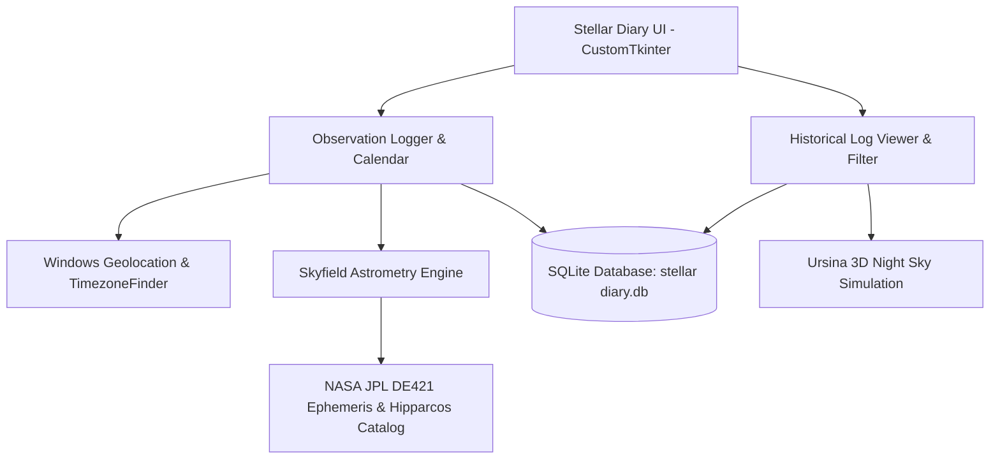

# 🔭 Stellar Diary (Project Lumen)

> **A specialized observation logger and 3D night-sky visualizer for visual astronomy.**

[](https://www.python.org/)
[](https://github.com/TomSchimansky/CustomTkinter)
[](https://www.sqlite.org/)
[](https://rhodesmill.org/skyfield/)
[](https://www.ursinaengine.org/)
[](https://github.com/MugenSama-01/stellar-diary)

---

### 🚀 Project Status
**Current Progress:** `🟢🟢🟢🟢🟢🟢🟢🟢🟢⚪` **(90% Complete)**

Stellar Diary (Project Lumen) is a dedicated astronomical logbook designed to bridge the gap between naked-eye stargazing observations and digital computational astronomy. It empowers visual astronomers to record structured celestial observations, automatically compute astronomical coordinates (Altitude/Azimuth) via NASA ephemerides, and recreate the sky of any logged night inside an interactive 3D celestial sphere.

---

### 📸 Interface Snapshot

<div align="center">
  
</div>

---

### 🌌 Key Features

- 📍 **Automated Windows Geolocation & Timezones**
  - Fetches exact latitude, longitude, and accuracy via the native Windows Geolocation API (`winrt`).
  - Automatically maps geographical coordinates to exact IANA timezones using `TimezoneFinder`.

- ⭐ **Hipparcos Star Catalog Integration**
  - Integrated with the **ESA Hipparcos Catalog** (`hip_main.dat` & `stars.csv`).
  - Auto-resolves proper star names to their official HIP catalog numbers and vice versa.

- 📐 **High-Precision Astrometric Ephemerides**
  - Computes topocentric **Altitude** and **Azimuth** using the **NASA JPL DE421 Ephemeris** and the **Skyfield** astronomical library.
  - Automatically converts local observation timestamps to standard UTC for astronomical consistency.

- 📝 **Structured Night-Sky Logging**
  - CustomTkinter dark-mode user interface with celestial imagery.
  - Log observation window (start/end time), **Bortle scale** light pollution rating (0–9), local weather conditions, apparent brightness, and cardinal direction.

- 🗃️ **Local & Offline SQLite Storage**
  - Fully private, zero-cloud dependency with local SQLite database (`stellar diary.db`).
  - Filter past logs by calendar date or HIP identifier with one-click data reset.

- 🪐 **Interactive 3D Night Sky Simulation**
  - Powered by the **Ursina 3D Engine**.
  - Projects stored Azimuth, Altitude, and brightness values onto an interactive 3D celestial dome to visually replay past observation sessions.

---

### 🛠️ Architecture & Tech Stack



| Component | Technology | Description |
| :--- | :--- | :--- |
| **GUI Framework** | `customtkinter`, `tkcalendar`, `Pillow (PIL)` | Modern dark-themed GUI with custom celestial backdrops |
| **Astrometry & Math** | `skyfield`, `pandas`, `numpy` | Apparent Alt/Az calculation & coordinate transformations |
| **Ephemeris & Catalogs**| `de421.bsp`, `hip_main.dat` | NASA JPL planetary ephemeris & ESA Hipparcos star catalog |
| **3D Rendering** | `ursina` | 3D celestial dome projection and observation playback |
| **Geolocation** | `winrt-Windows.Devices.Geolocation`, `timezonefinder` | Automated system GPS coordinate extraction |
| **Storage** | `sqlite3` | Local database storing star sightings and observation metadata |

---

### 📋 Progress Tracker (90%)

- [x] **Core GUI Development**: Modern CustomTkinter menus, new log form, and historical log table.
- [x] **Windows Geolocation API**: Direct Windows OS GPS integration for automatic coordinate detection.
- [x] **Astrometric Engine**: Integration of `skyfield` with DE421 ephemeris and Hipparcos dataset.
- [x] **Database & Query Engine**: Relational SQLite schema with indexing on UTC time, HIP IDs, and location.
- [x] **Calendar & Log Filtering**: Interactive visual calendar tagging and multi-parameter filtering.
- [x] **3D Sky Visualizer Prototype**: Ursina 3D celestial dome projection based on calculated Azimuth/Altitude.
- [ ] **Polishing & Final 10%**:
  - [ ] Polish 3D celestial sphere texture & constellation overlay lines.
  - [ ] Support planetary tracking (Jupiter, Saturn, Mars, Venus) alongside stars.
  - [ ] Export observation journals to CSV / PDF format.

---

### ⚡ Getting Started

#### 1. Prerequisites
- Python **3.10** or higher
- Windows 10/11 (for native Windows Geolocation support)

#### 2. Clone the Repository
```bash
git clone https://github.com/MugenSama-01/stellar-diary.git
cd stellar-diary
```

#### 3. Set Up Virtual Environment & Dependencies
```bash
# Create virtual environment
python -m venv .venv

# Activate virtual environment (Windows PowerShell)
.venv\Scripts\Activate.ps1

# Install required packages
pip install customtkinter pillow tkcalendar skyfield pandas timezonefinder ursina
```
*(Optional for Windows Geolocation)*:
```bash
pip install winsdk
```

#### 4. Required Data Files
Ensure the following ephemeris and catalog files are located in the project root:
- `de421.bsp` (NASA JPL Ephemeris)
- `hip_main.dat` (Hipparcos Star Catalog)
- `stellar diary.db` (SQLite Database)

#### 5. Launch the Application
```bash
python UI.py
```

---

### 💫 Usage Guide

1. **New Log**:
   - Select the observation date from the interactive calendar.
   - The app will automatically fetch your GPS coordinates and timezone.
   - Select the star name from the dropdown or enter a Hipparcos (HIP) ID.
   - Input observation details: Time window, Bortle level, weather condition, sky direction, and apparent brightness.
   - Click **Add** to queue the observation, then **Save** to commit to the database.

2. **Check Old Logs**:
   - Browse through logged observations.
   - Filter logs by specific observation dates or target HIP IDs.
   - Click **Visualise** to render the celestial sphere in 3D.

---

### 👨‍💻 Author & Acknowledgments

- **Developer**: [MugenSama](https://github.com/MugenSama-01) (Tanishk Roychowdhury)
- **Data Sources**:
  - [NASA Jet Propulsion Laboratory (JPL)](https://ssd.jpl.nasa.gov/) for planetary ephemerides.
  - [European Space Agency (ESA)](https://www.cosmos.esa.int/web/hipparcos) for the Hipparcos star catalog.
  - [Brandon Rhodes](https://rhodesmill.org/skyfield/) for the Skyfield Python astronomy library.

---

<div align="center">
  <b>✨ <i>"Keep Looking Up!!!"</i> ✨</b>
</div>
